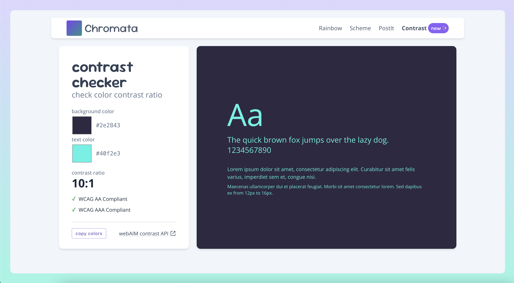
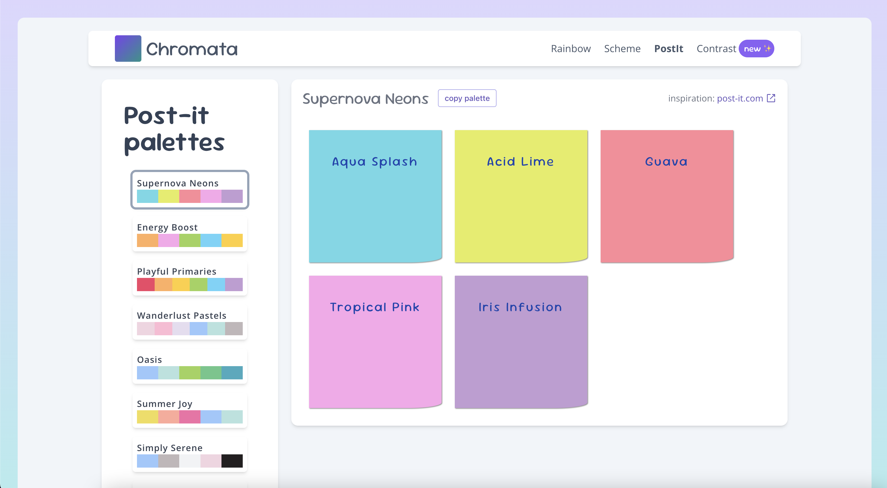

# Chromata

## **[chromata.vercel.app](https://chromata.vercel.app/)**

> "Chromata" is Greek for "colors"

this is a learning playground

based on the [react starter kit](https://github.com/Mrtly/react-vite-starter)

utilizing tanstack router, the View transitions API, gsap & all the fun tools ✨

### features

#### Color contrast checker

using the [webAIM](https://webaim.org/) conrast API

#### Post-it palettes

inspired by the new [Post-it Collections](https://www.post-it.com/3M/en_US/post-it/ideas/color/collections/)

#### Palette generation

using [thecolorapi](https://www.thecolorapi.com/)

- **Rainbow palette**

  a rainbow palette of colors spanning across the color circle

- **Color scheme palette**

  color schemes from various HSL values

